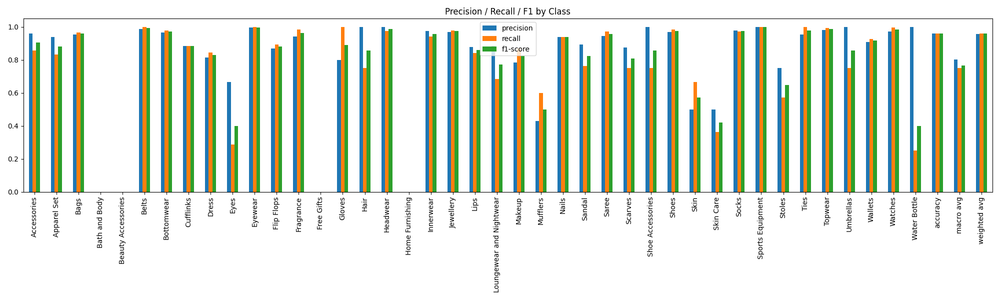

# vlm_basic_classifier
Add classifier end to CLIP pre-trained model
to classify FashionDataset

<figure>
    
    <figcaption>Figure 1: Classification Performance.</figcaption>
</figure>

Using Crossentropy to map to known text

Notes:
- Missing classes may be due to class imbalance or low confidence
- Remedies: weighted loss function, oversample minority class, data augmentation on minority class, reduce learning rate, label smoothing
