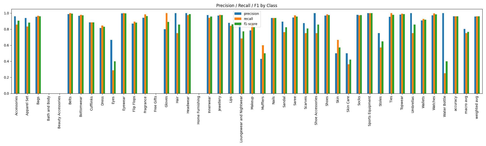
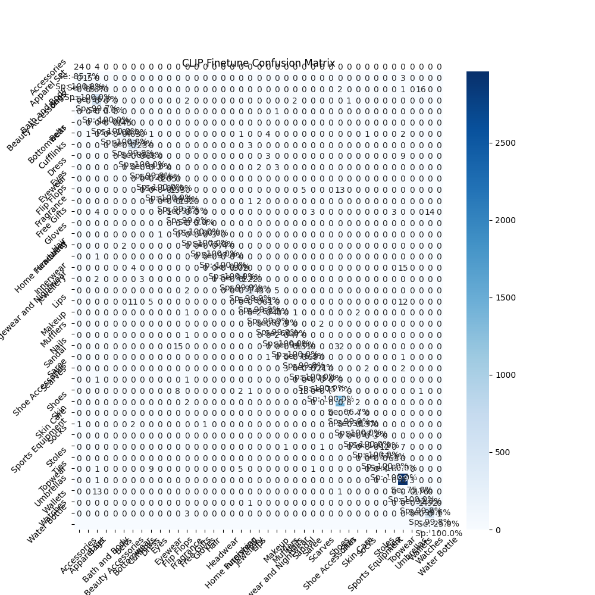

# vlm_basic_classifier

Two scripts exploring vision-language classification:

- **`basic_classifier.py`** — trains a small CNN + text-embedding VLM from scratch on CIFAR-10 using InfoNCE contrastive loss with a learnable temperature parameter.
- **`clip_finetune.py`** — fine-tunes CLIP's `visual_projection` layer with a linear classifier head on the Fashion Products dataset, with train-time augmentation and WiSE-FT weight interpolation after training.

<figure>
    
    <figcaption>Figure 1: Per-class precision / recall / F1 on the validation set.</figcaption>
</figure>

<figure>
    
    <figcaption>Figure 2: Confusion matrix with per-class sensitivity and specificity.</figcaption>
</figure>

---

## Setup

This project uses [uv](https://docs.astral.sh/uv/) for environment and dependency management.

### Prerequisites

Install `uv` if you don't have it:

```bash
# macOS / Linux
curl -LsSf https://astral.sh/uv/install.sh | sh

# Windows (PowerShell)
powershell -ExecutionPolicy ByPass -c "irm https://astral.sh/uv/install.ps1 | iex"
```

### Install dependencies

```bash
uv venv            # create .venv in the project directory
uv sync            # install all dependencies from pyproject.toml
```

#### GPU / CUDA support (optional)

By default, `uv sync` installs the CPU-only PyTorch wheels. To use CUDA, uncomment and configure the `[[tool.uv.index]]` block in [pyproject.toml](pyproject.toml), then re-run `uv sync`.

---

## Usage

```bash
# Custom VLM trained with contrastive loss on CIFAR-10
uv run python basic_classifier.py

# Fine-tune CLIP on the Fashion Products dataset
uv run python clip_finetune.py
```

---

## Files

| File | Description |
|------|-------------|
| [basic_classifier.py](basic_classifier.py) | Custom CNN + text-embedding VLM with learnable-temperature InfoNCE loss on CIFAR-10 |
| [clip_finetune.py](clip_finetune.py) | CLIP fine-tuning: trains `visual_projection` + linear head on FashionDataset; applies WiSE-FT after training |
| [plotter.py](plotter.py) | Shared utilities: confusion matrix with sensitivity/specificity, t-SNE, classification report bar chart |
| [pyproject.toml](pyproject.toml) | Project dependencies and ruff configuration |
| [figures/](figures/) | Output plots: confusion matrices, bar charts, t-SNE |
